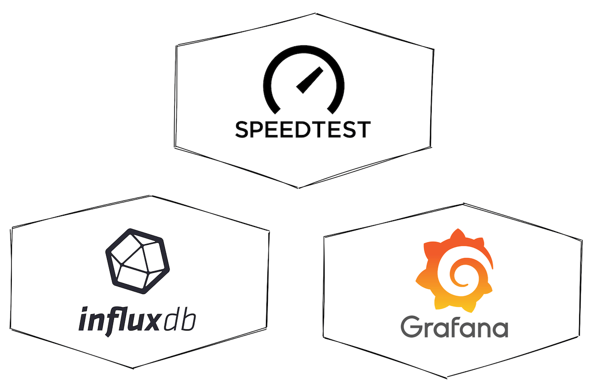
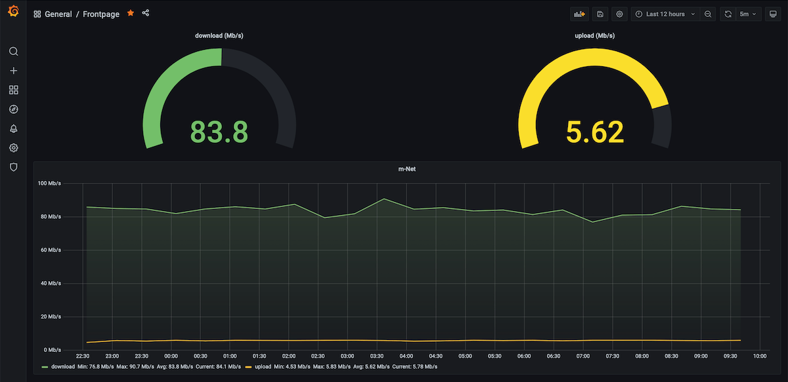

# Speed Test + InfluxDB + Grafana inside arm32v7 architecture

Docker setup for arm32v7 architecture to run [Internet Speed Test](https://github.com/robinmanuelthiel/speedtest), [InfluxDB](https://hub.docker.com/r/arm32v7/influxdb/) and [Grafana](https://hub.docker.com/r/grafana/grafana) in a container.

**Extras:** Containers running [Portainer](https://www.portainer.io) and [Chronograf](https://hub.docker.com/r/arm32v7/chronograf/).

## References
* [How To Install Docker and Docker-Compose On Raspberry Pi](https://dev.to/elalemanyo/how-to-install-docker-and-docker-compose-on-raspberry-pi-1mo)
* [robinmanuelthiel/speedtest](https://github.com/robinmanuelthiel/speedtest)
